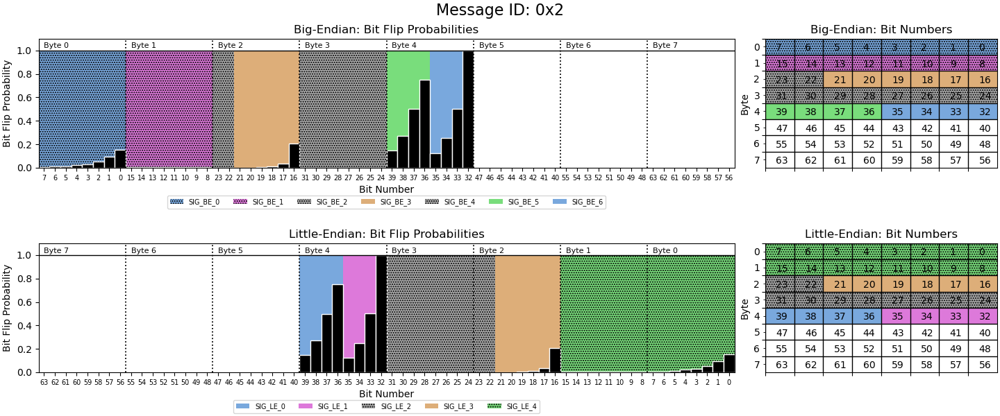
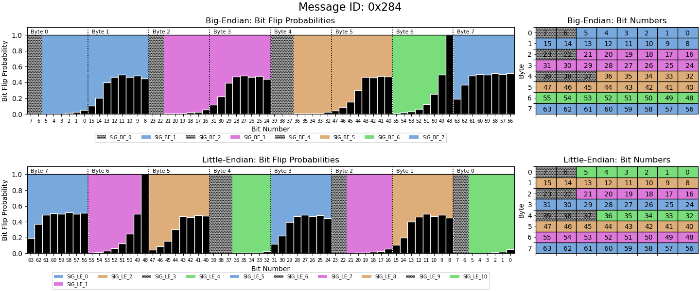
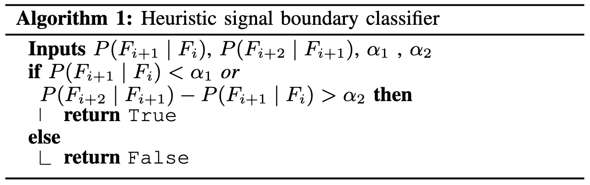
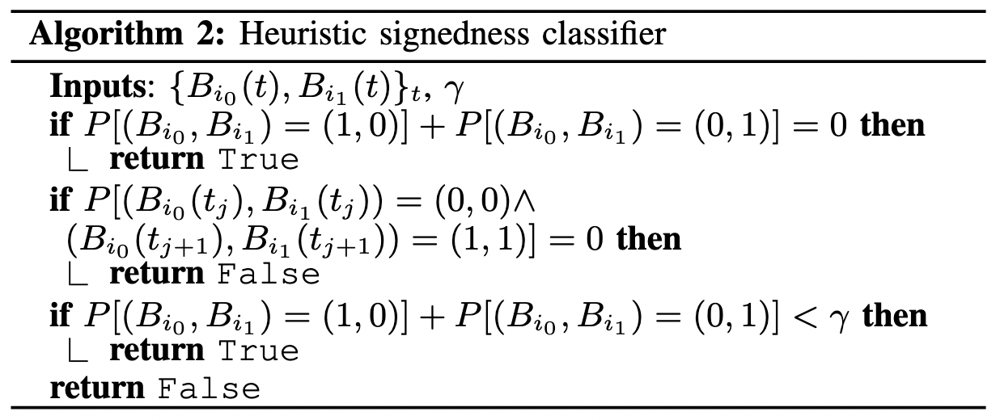

# Decoding

### Overview
- All decoding is performed on a recorded `.csv` log file created with `PandaCANDecoder.Logger()`
- Real-time decoding is not currently supported

### Example with walk-through
- [`decode_example.ipynb`](./examples/decode_example.ipynb)

### Key Functionalities

#### 1. Message Decoding Figure

_Example figure 1:_

_Example figure 2:_

**Legend:**
- Predicted signals are colored and named according to the legend
- Signals in grey are constant throughout the entire recoding
- Signals predicted to be signed are shaded with dots
- White bytes are unused

**Intuitive analysis:**
- The bit flip probabilities of a _time series signal_ form a continuous smooth curves with LSB having the highest bit flip probability and MSB having the least.
    - Demonstration:
        - Example 1 `SIG_LE_4` shows the message is Little-Endian
        - Example 2 `SIG_BE_1` shows the message is Big-Endian
- _Counters_ have a linear bit flip probability spread and the LSB has a very high (often 1.0) bit flip probability.
    - Demonstration:
        - Example 1 `SIG_LE_1`
- _Checksums_ have a non-uniform flip probability spread. Often many bits will have the same bit flip probability.
    - Demonstration:
        - Example 2 `SIG_BE_7`

#### 2. Signal Predicting
**Boundary (start bit and length):**
- Method 1: TANG (Transition Aggregation N-Gram) [1]
    - More significant bits will have lower bit flip probability
    - F-Score: 84.9% [2]
- Method 2: Conditional Bit Flip [2]
    - Bits in the same signals are more likely to flip conditional on the previous bit flipping
    - F-Score: 98.1% [2]
    - Algorithm [2]:
    

**Signedness:**
- Method 1: Most Significant Bits [2]
    - The two most significant bits of a two's complement signed integer follow a specific flipping pattern
    - F-Score: 97.3% [2]
    - Algorithm [2]:
    

[1] “Unsupervised Time Series Extraction from Controller Area Network Payloads” by Nolan et. al.

[2] “CAN-D: A Modular Four-Step Pipeline for Comprehensively Decoding Controller Area Network Data” by Verma et. al.

#### 3. Signal Matching
**Linear regression:**
- Linear regression is performed between a target signal (_y_) and all predicted and manually created signals (_x_) to find models of the form _y = mx + b_
- This model adjusts for scaling and offset differences between signal values
- R^2 scores are calculated to asses the accuracy of each model and therefore the match between the signals

_Updated: 08/04/2022_
