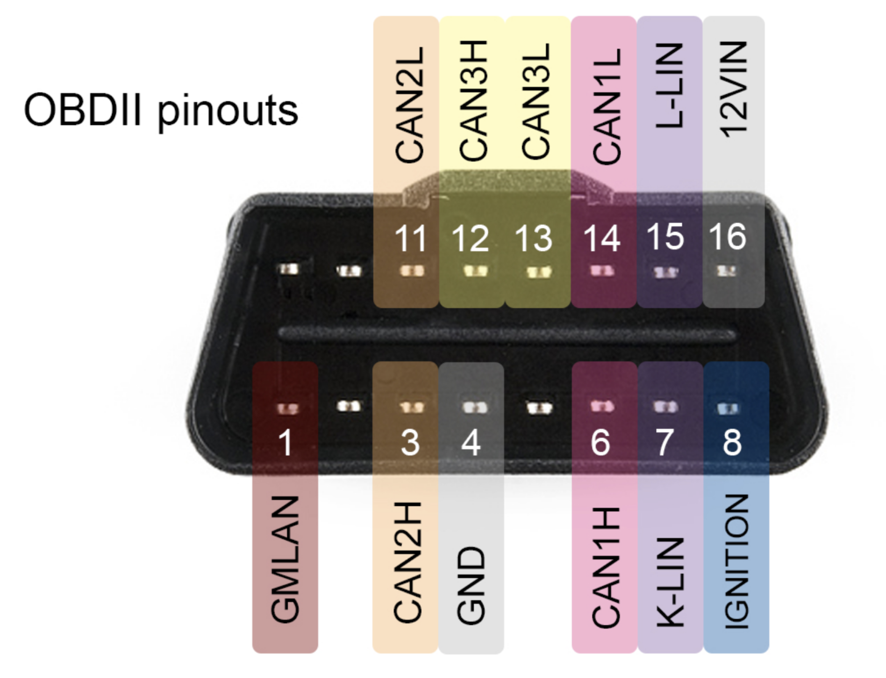

# Hardware
#### General Notes
- All code was tested using White and Grey Pandas
- White Panda pinout ([source](https://github.com/commaai/panda/blob/master/docs/guide.pdf)):



- Pandas can be connected to the OBD-II port for diagnostic requests or the high-speed internal CAN buses for logging
- Sending non-diagnostics CAN messages is currently not supported by this library

#### Safety Modes

```python
panda = Panda()

# for listening
panda.set_safety_mode(Panda.SAFETY_SILENT)

# for diagnostics/PID requests
panda.set_safety_mode(Panda.SAFETY_ELM327)

# for sending any CAN message
panda.set_safety_mode(Panda.SAFETY_ALLOUTPUT)
```

- `Panda.SAFETY_ALLOUTPUT` does not work on stock firmware. Firmware from [`boardesp-archive` branch](https://github.com/commaai/panda/tree/boardesp-archive) must be installed

_Updated: 08/03/2022_
